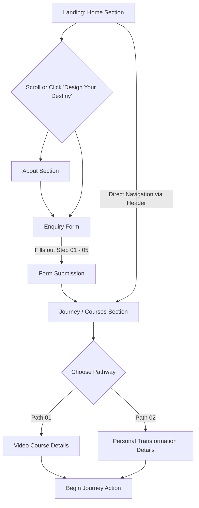

# Site Structure, Sitemap, and User Flow

## 1. Site Structure (Directory Layout)
The project is built as a static Single Page Application (SPA) with a clean, classic architecture.

```text
/ (Root Directory)
├── index.html        # Main HTML file containing all SPA sections
├── css/
│   ├── fonts.css     # Font declarations
│   └── style.css     # Main stylesheet for layout and design
├── js/
│   ├── config.js     # Configuration variables
│   ├── lucide.min.js # Icon library
│   └── main.js       # Core application logic (SPA routing, transitions, form handling)
├── img/              # Images and assets (backgrounds, course images, favicon)
└── fonts/            # Custom typography files
```

## 2. Sitemap (Logical Sections)
Since the application is a Single Page Application (SPA), navigation is handled dynamically by hiding and showing sections within `index.html`. 

- **Home (`#home`)**: Landing view with a hero section and introduction to the journey.
- **About (`#about`)**: Background story, transformation journey, and core beliefs of Prathiba Senthil.
- **Journey / Courses (`#courses`)**: Main pathways offered to the user.
  - **Video Course View (`#course-detail-video`)**: Details for the "Job / Money Manifestation" Course.
  - **Personal Course View (`#course-detail-personal`)**: Details for the "The Supernatural - 6 Month Personal Course".
- **Enquiry Form (`#form`)**: A multi-step questionnaire for users to express their current state, goals, and desired course.

## 3. User Flow

The user experience is designed as a guided journey of discovery and choice.



### Flow Breakdown:
1. **Entry Point (Home):** The user lands on the Home section. They are presented with the core philosophy and a call-to-action (CTA) to "Design Your Destiny" or "Begin Your Journey".
2. **Discovery (About):** Users can navigate to the About section via the header to build trust and understand the founder's transformation story.
3. **Qualification (Enquiry Form):** Both the Home CTAs and natural progression lead the user to the Enquiry Form. This form asks for:
   - Name
   - Email
   - Mobile Number
   - Preferred Course Type (Video vs. Personal)
   - Specific needs/goals
4. **Pathway Selection (Courses):** Upon completing the form (or navigating directly via the header menu), the user views the available journeys.
5. **Detailed Exploration:** Selecting a specific course expands a detailed view explaining the timeline, features, and pricing, leading to the final "Begin Your Journey" action (which typically routes to a checkout or WhatsApp flow handled by `main.js`).
